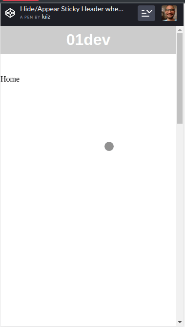

## Introdução

Você provavelmente já viu esse efeito de menu. Aplicativos como WhatsApp e Spotify usam e abusam deste tipo de mecanismo.

Se você alguma vez (assim como eu) já se perguntou em como reproduzir esse efeito com CSS/JS, aqui está o caminho das pedras em como reproduzir este efeito incrível.

## Por que usá-lo?

Em alguns momentos, você vai querer que um elemento muito importante (como um menu de navegação) esteja fixo na tela do usuário.

Porém, isso traz uma desvantagem: ele consome parcialmente a altura da tela. Isso compromete a leitura do conteúdo final.

Esse efeito vem para que ao mesmo tempo que o elemento importante mantenha-se visível, você consiga manter o foco do usuário no conteúdo final.

## Resultado final

Você pode acompanhar um exemplo do resultado final [aqui](https://codepen.io/luizhrqas/pen/WNvzXjE).



## Marcação HTML necessária

O único elemento importante aqui é o `.sticky-header`. O `.content` é apenas para mostrar o scroll no exemplo final.

```html
<header class="sticky-header">
  <h1>01dev</h1>
</header>

<main class="content">
  <section>Home</section>
  <section>Sobre</section>
  <section>Contato</section>
</main>
```

## Estilizando o menu

Nós vamos precisar de algumas estilizações para que nosso efeito funcione.

O nosso `.sticky-header` vai ser posicionado fixamente.

No nosso efeito de transição no JavaScript, nós iremos indicar no `body`, se o usuário está scrollando pra cima ou para baixo.

Graças a essa indicação, iremos fazer o efeito de transição de ocultar/exibir o elemento:

```css
.sticky-header {
  transition: all 0.4s;
  position: fixed;
  left: 0;
  top: 0;
  width: 100%;
}

.scroll-down .sticky-header {
  transform: translate3d(0, -100%, 0);
}

.scroll-up .sticky-header {
  transform: none;
  box-shadow: 0 0 20px rgba(0, 0, 0, 0.15);
}
```

## Criando efeito com JavaScript

Para implementarmos esse efeito,como dito anteriormente, vamos precisar de uma classe `.scroll-down` e `.scroll-up`:

- Ao scrollar para baixo, o `body` irá receber a classe `.scroll-down`;
- Ao scrollar para cima, o `body` irá receber a classe `.scroll-up`;
- Se o usuário scrollar até o topo da página, o `body` irá perder a classe de `.scroll-up`, resetando nosso elemento para o estado inicial.

Para detectarmos a direção do scroll, nós vamos armazenar a última posição do scroll em uma variável `lastScroll`.

O valor inicial de `lastScroll` será de `0`.

Então, conforme ocorrer scroll na tela, nós iremos atualizar o valor de `lastScroll`.

- Se a nova posição do scroll for maior que a última posição, significa que nosso usuário está scrollando para baixo.
- Se a nova posição do scroll for menor que a última posição, significa que nosso usuário está scrollando para cima.

Nós podemos reproduzir esse algoritmo com o código abaixo:

```js
const body = document.body

// Atalho para as classes
const scrollUp = "scroll-up"
const scrollDown = "scroll-down"

// Variável que irá armazenar a última posição do scroll
let lastScroll = 0

// Callback que será acionado quando a janela do browser sofrer algum scroll
const onWindowScroll = () => {
  // Salvamos a posição do scroll Y atual em uma variável
  const currentScroll = window.pageYOffset

  // Se a posição atual for 0, remove a classe de `.scroll-up`
  if (currentScroll === 0) {
    body.classList.remove(scrollUp)
    return
  }

  // Se a posição atual for maior que a última posição, nosso usuário está scrollando pra baixo
  if (currentScroll > lastScroll && !body.classList.contains(scrollDown)) {
    // down
    body.classList.remove(scrollUp)
    body.classList.add(scrollDown)
    // Do contrário, se a posição atual for menor que a última posição, nosso usuário está scrollando pra cima
  } else if (
    currentScroll < lastScroll &&
    body.classList.contains(scrollDown)
  ) {
    body.classList.remove(scrollDown)
    body.classList.add(scrollUp)
  }
  // Independente do que ocorrer, salvamos a posição atual como a última posição
  lastScroll = currentScroll
}

// Adicionamos o nosso callback de scroll para o nosso elemento `window`
window.addEventListener("scroll", onWindowScroll)
```

## Conclusão

Esse é um efeito muito simples e que agrega MUITO na experiência do usuário. Vemos ele sendo aplicado cada vez mais nos sites/aplicativos por aí.

Tem algum elemento fixo no seu projeto? Que tal aplicá-lo? Seu usuário será eternamente grato. :D

Espero que tenham gostado e até a próxima! 😺


